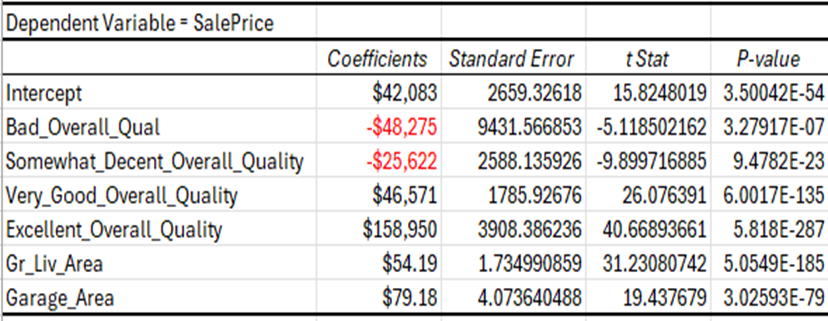

# Ames Real Estate Market Analysis and Predictive Modeling

## Overview
This project focuses on analyzing historical housing market data from Ames, Iowa, to develop a predictive model for home sale prices. By leveraging statistical methods and regression analysis, we provide actionable insights for homeowners and realtors. The project includes data cleaning, feature engineering, and the implementation of multiple regression models to identify key factors influencing home value.

---

## Key Objectives
- Predict home sale prices based on significant features.
- Identify key variables that influence the market value of a home.
- Provide actionable recommendations to homeowners for optimizing property value.

---

## Dataset Overview
- **Source:** Ames Housing Dataset
- **Size:** 2,931 rows and 82 columns
- **Features:** Includes house attributes (e.g., quality, condition, living area), property details (e.g., garage area, lot frontage), geographic data, and sale information.

### Assumptions and Conditions
- Data accurately represents the Ames housing market.
- Blank values (excluding `Lot_Frontage`) are assumed to represent `0` or N/A.
- Subjective variables like `Overall_Qual` and `Overall_Cond` rely on ordinal scales, which are inherently subjective.
- Analysis focuses exclusively on single-family households.

---

## Tools and Skills Used
- **Tools:** Excel, Powerpoint, Word
- **Techniques:** Data cleaning, regression analysis, feature engineering

---

## Key Findings
### Regression Analysis (Final Model)
- **Overall Quality**: Homes in the "Excellent" category have a $158,950 higher sale price than those in the "Good" category.
- **Living Area**: Every additional square foot adds approximately $54.19 to the sale price.
- **Garage Area**: Each additional square foot increases the price by $79.18.
- Cost-effective improvements to raise home quality (e.g., from "Somewhat Decent" to "Good") can significantly boost home value.
  

---

## Recommendations
1. **Home Quality Improvements**
   - Focus on cost-effective renovations, especially for homes in the "Bad" or "Somewhat Decent" categories.
   - Invest in areas like kitchens, bathrooms, and structural improvements to improve overall quality.

2. **Living and Garage Area**
   - Expanding above-ground living area or garage space offers a desirable ROI.

3. **Marketing Strategies**
   - Emphasize quality features in property listings to attract higher offers.

---

## Future Work
- Explore the use of machine learning models (e.g., Random Forests, XGBoost) for improved prediction accuracy.
- Incorporate additional economic and market trend data to enhance the model.
- Refine data cleaning and outlier handling processes for variables like `Lot_Frontage` and `Year_Remodel`.

---

## Report & References
- The detailed report is available [here](./Ames_Final_Essay_Complete.docx).
- The detailed presentation is availavble to download via google drive [here](https://docs.google.com/presentation/d/1bu34NsPTy8BAHwYhr_DIaWDWCJ3zw9IX/edit?usp=sharing&ouid=117238299490082419129&rtpof=true&sd=true)
- The excel reference work is available [here](./Ames_Housing_Analysis_Reference_Material.xlsx).
- The raw file is available [here](./ames.xlsx).

---

## Contact
Feel free to connect with me or reach out with any questions:
- **Email**: [ethnmcmanus@gmail.com](mailto:ethnmcmanus@gmail.com)
- **LinkedIn**: [linkedin.com/in/ethan-mcmanus](https://www.linkedin.com/in/ethan-mcmanus)
